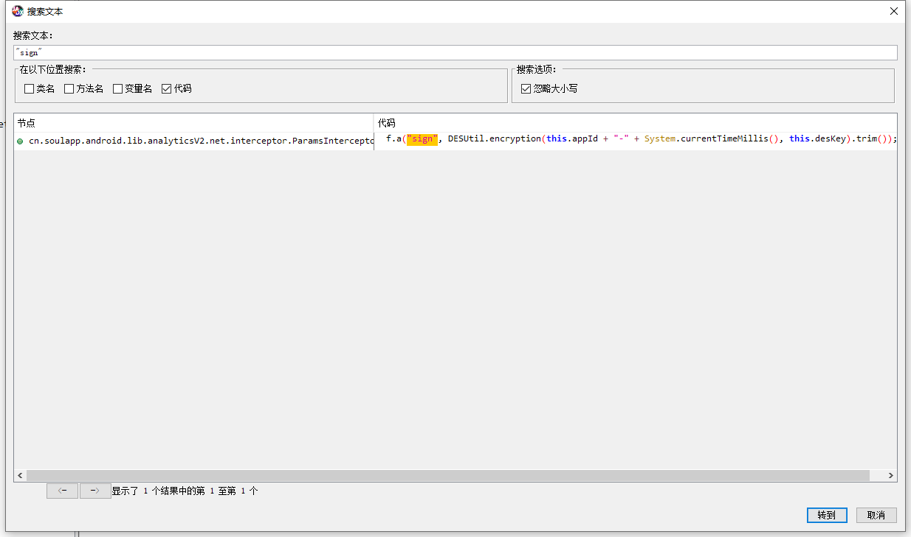
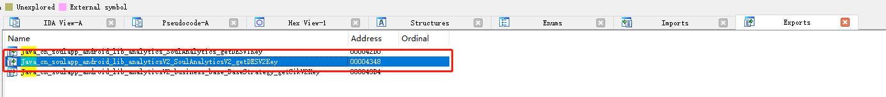

# Soul逆向笔记

## 一、序言

本文以Soul APP最新版为例，讲解逆向一个安卓版本的APP关键点到还原算法的具体步骤。

Soul 3.53.0 应用宝渠道

设备Pixel，安卓系统8.0

* 注：本文仅以学习为目的，如有侵权请告知。

## 二、抓包

如图，定位接口找到加密参数的名称sign


# 三、Java层反编译

使用jadx-gui，gda等反编译工具，查看APP的Java层代码。

如图，搜索文本“sign”后无任何结果显示，此时考虑两种情况，第一种是APP加壳保护，第二种则是反编译过程中出错，如内存溢出等。

如图，打开AndroidManifest.xml，找到application标签，可以看到声明的类名为com.security.shell.AppStub1，根据经验，当application类名和APP包名相差甚远时，大概率是由于加壳了。


接下来就尝试使用加壳杀器FART脱壳

启动APP后，如图，FART会自动在安装目录下导出脱壳后的dex文件


此时，再使用adb pull /data/data/cn.soulapp.android soulapp/，把以上脱壳的dex文件都下载到电脑上，这样就能通过反编译工具查看到原本的Java层代码了。

再根据抓包找到的关键参数名称进行搜索，定位到相关的Java层代码。




跟进代码发现sign的算法为DES加密，加密数据为this.appId + "-" + System.currentTimeMillis()，通过搜索appId，发现与参数中的aid值相同，因此可以快速检索得出appId的值为10000003；


加密Key则需要跟进调用层，对ParamsInterceptor类查找用例，跟进StrategyFactory类；


继续跟进StrategyFactory的调用层，查找用例


最终发现DES算法的key来源于native层

## 四、native层反编译

用IDA Pro反编译libsoul-analytics.so

首先在Exports导出符合搜索java，可以看到JNI函数Java_cn_soulapp_android_lib_analyticsV2_SoulAnalyticsV2_getDESV2Key



F5反汇编之后修改参数类型JNIEnv*，此时找到加密的key为soulapp123!@#


## 五、还原算法

```
public static String sign() {
	return DESUtil.encryption("10000003-" + System.currentTimeMillis(), "soulapp123!@#").trim());
}
```
